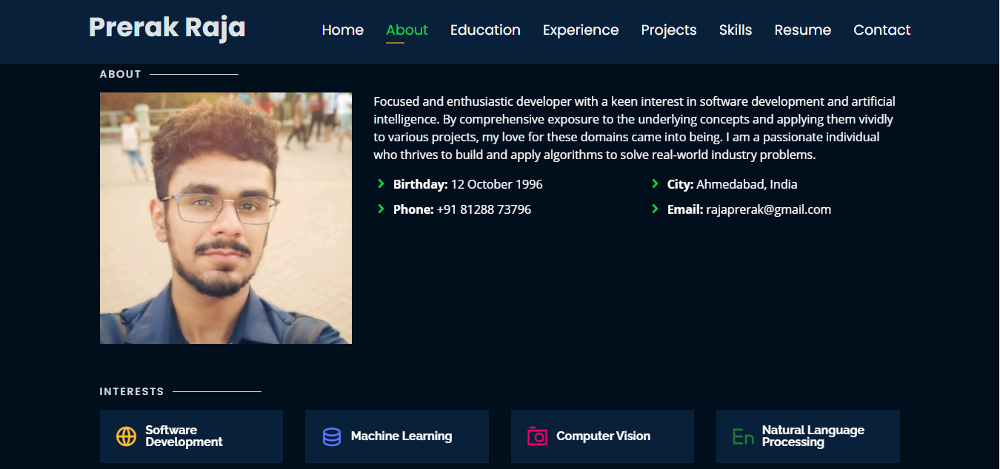

# Personal Portfolio 🔥
> https://PayalKhattri.github.io/
<!--
### Website Preview
#### Home Page

 
  <kbd>
    
  </kbd>

#### About Page

 
  <kbd>
    
  </kbd>

#### Projects Page

 
  <kbd>
    
  </kbd>

## Features 📋
⚡️ Fully Responsive\
⚡️ Valid HTML5 & CSS3\
⚡️ Typing animation using `Typed.js`\
⚡️ Easy to modify

## Sections 📚
✔️ About\
✔️ Interests\
✔️ Education\
✔️ Online Certification\
✔️ Experience\
✔️ Projects \
✔️ Skills \
✔️ Resume\
✔️ Contact Info

-->
